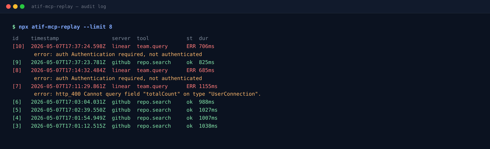

# MCP Toolkit

Three production-grade Model Context Protocol servers in one monorepo: GitHub, Linear, Gmail. Drop them into Claude Desktop or Cursor and your AI client can read, write, and reason over your real tools.

Most public MCP examples are toy demos. These ship with auth, audit logging, rate-limit handling, and tightly scoped tool definitions so you can hand them to a teammate without losing sleep.

## What's inside

- **GitHub MCP** — issue CRUD, PR review, repo search. Authenticates via personal access token.
- **Linear MCP** — issue CRUD, project and team queries. Authenticates via Linear API key.
- **Gmail MCP** — read, send, label messages. OAuth flow with documented Google Cloud setup.
- **Shared core** — auth helpers, SQLite audit log (Postgres optional), structured logging.

Every tool call gets logged with timestamp, arguments, and response. You can replay what your AI agent did, which matters once you give it write access.

## Why this exists

MCP turns Claude and Cursor into agents that touch your real systems. The reference servers from Anthropic are great teaching material but stop short of production. This repo fills the gap: tokens scoped per tool, no shared secrets, errors that surface rate-limit details, and a clean local audit trail.

It also serves as the proof artifact behind the Custom MCP Server gig on Fiverr and Upwork. If you found this repo first, the gig is here: [fiverr.com/atif_ali_pm](https://www.fiverr.com/atif_ali_pm).

## How buyers use it

1. Clone the repo or `npx` the published package.
2. Add the server entry to `claude_desktop_config.json` (or your Cursor MCP config).
3. Drop in your API tokens via env. Zero hosting required, the server runs inside the AI client process over stdio.

## Phases

- Phase 0: monorepo scaffold (pnpm workspace, shared `packages/core`)
- Phase 1: GitHub MCP server
- Phase 2: Linear MCP server
- Phase 3: Gmail MCP server
- Phase 4: Shared audit module (SQLite default, Postgres opt-in)
- Phase 5: README polish, demo recordings
- Phase 6: Optional one-shot CLI installer

Status: scaffolded.

## Screenshots

