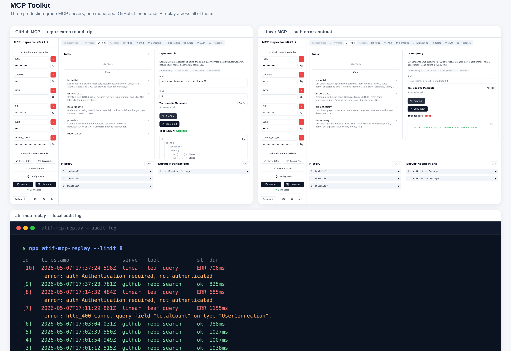
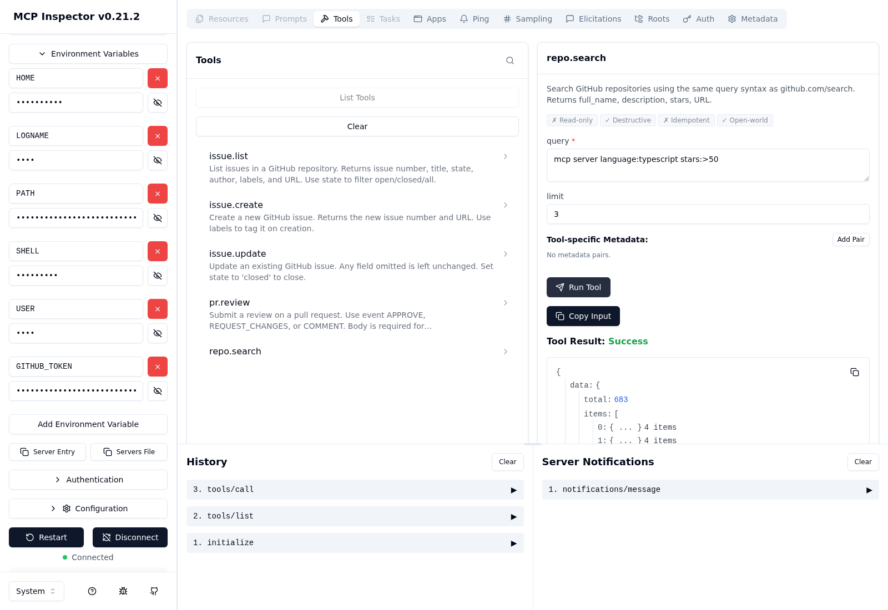
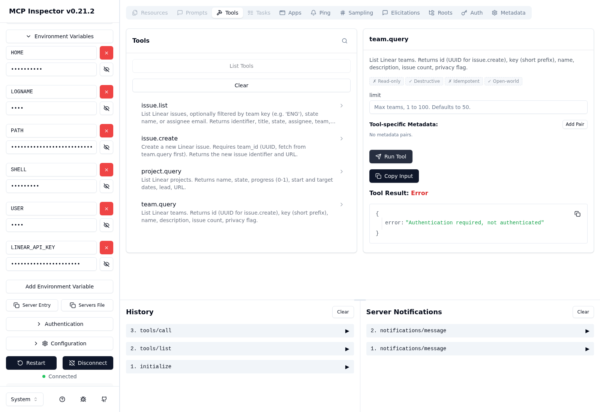

# MCP Toolkit

Three production-grade Model Context Protocol servers in one TypeScript monorepo: **GitHub, Linear, Gmail**. Drop them into Claude Desktop, Cursor, or any MCP client and your assistant can act over your real tools, with every call recorded to a local audit log.

[](LICENSE)
[](https://modelcontextprotocol.io)
[](https://www.typescriptlang.org/)

## Quick start

```bash
git clone https://github.com/atifali-pm/mcp-toolkit
cd mcp-toolkit
pnpm install && pnpm -r build
```

Then add a server entry to `claude_desktop_config.json` (or your Cursor MCP config):

```json
{
  "mcpServers": {
    "github": {
      "command": "node",
      "args": ["/absolute/path/to/mcp-toolkit/packages/github/dist/index.js"],
      "env": { "GITHUB_PERSONAL_ACCESS_TOKEN": "ghp_..." }
    }
  }
}
```

Restart your MCP client and the GitHub tools show up. Same pattern for Linear and Gmail. The OAuth flow for Gmail, plus token tables and per-tool walkthroughs, live in [HANDS-ON.md](HANDS-ON.md).

## What's inside

| Server | Tools | Auth |
|---|---|---|
| **GitHub** | issue CRUD, PR review, repo search | Personal Access Token |
| **Linear** | issue CRUD, project and team queries | Linear API key |
| **Gmail** | message list, read, send, label apply | OAuth2 with refresh |
| **Shared core** | auth helpers, SQLite audit log (Postgres optional), structured logging | n/a |

Every tool call gets logged with timestamp, arguments, and response. You can replay exactly what your AI agent did, which matters once you give it write access. The bundled replay CLI prints the most recent calls from the audit log with success and error rows coloured differently.

## Why this exists

MCP turns Claude and Cursor into agents that touch your real systems. The reference servers from Anthropic are excellent teaching material but stop short of production. This repo fills the gap. Tokens stay scoped to one tool at a time, errors surface the underlying rate-limit details instead of swallowing them, and the audit trail sits in a local SQLite file you can inspect with `sqlite3` or the bundled replay CLI. Nothing leaves your machine.

Zero hosting required. The servers run inside the MCP client process over stdio. No background daemon, no Docker, no cloud account.

## Screenshots








## Architecture

`packages/core` holds the shared pieces: auth token loading, SQLite (or Postgres) audit logger, structured logger, common error types. Each server package wraps those plus a domain client (Octokit for GitHub, the Linear SDK, googleapis for Gmail) into MCP tool definitions. Builds are isolated; you can ship one server without the others.

Adding a fourth server (Notion, Slack, Postgres, your-internal-API) is mostly a domain-client wrapping exercise once the shared core is in place.

## Status

- GitHub MCP: shipped
- Linear MCP: shipped
- Gmail MCP: shipped, OAuth flow plus token refresh plus label apply included
- Audit module: shipped, SQLite default, set `POSTGRES_URL` to switch
- Replay CLI: shipped, `atif-mcp-replay --last 50`
- One-shot installer: behind a flag, see HANDS-ON

## Contributing

Issues and PRs welcome. The monorepo uses pnpm workspaces; `pnpm -r test` runs every package's tests. Servers follow the same shape, so a Notion or Slack server is a reasonable first contribution if you want one.

## Commercial support

Need a custom MCP server tailored to your stack, or help wiring these into an existing AI workflow? I take commissions: [fiverr.com/atif_ali_pm](https://www.fiverr.com/atif_ali_pm).

## License

MIT. See [LICENSE](LICENSE).

---

If this saved you setup time, a star helps me keep building. Thanks.
